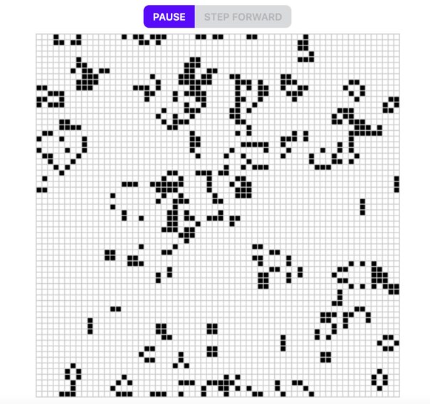

## Conway's Game of Life in WASM

Webassembly implementation of [Conway's Game of Life](https://en.wikipedia.org/wiki/Conway%27s_Game_of_Life).

Available [here](https://spectacular-khapse-742c17.netlify.app/).

The simulation is pausable. Once paused, one can move forward one step at a time.

### Requirements

* [rust](https://www.rust-lang.org/tools/install)
* [wasm-pack](https://rustwasm.github.io/wasm-pack/installer/) (version >= 0.11.0)
* yarn or npm

### Build and run locally

1. `wasm-pack build`
2. `cd www`
3. `yarn` (or `npm install`)
4. `yarn start` (or `npm start`)
5. visit http://localhost:8080
